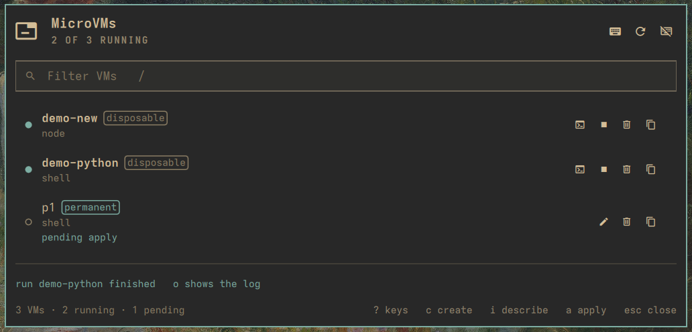

# nixarchy.microvm

NixOS MicroVMs for [Omarchy](https://omarchy.org/) on
[nixarchy](https://olafkfreund.github.io/nixarchy/), on the bar and on a key.
nixarchy has two kinds of VM, and this plugin puts both in one list:

- **disposable** VMs from `nixarchy vm`: created and destroyed freely, no
  root, no rebuild, state under `~/.local/state/nixarchy/microvm/<name>/`;
- **permanent** machines declared as
  `programs.nixarchy.services.microvm.machines.<name>`: they boot with the
  host under systemd, can forward an SSH port, and have fixed memory and
  cores.

From the keyboard you can start, stop, restart, open the console or the logs,
create, edit and delete them. A permanent VM is one line in
`~/.config/nixarchy/apps.nix`, written through nixarchy.pkg's writers after
you have reviewed it; applying it is your own `nixarchy-apply`, opened in a
terminal so you see everything it will rebuild. Optional AI assist fills the
create form from a sentence; it proposes values, and you confirm them.

The whole thing runs from the keyboard and follows your Omarchy theme. It comes
in two forms:

- **a bar widget**, whose popup opens under the glyph;
- **a full-screen menu** on a key or an Omarchy menu row.

Both share one state, so a job started in one is visible, and locked, in the
other.

[](https://olafkfreund.github.io/nixarchy-microvm/)

The showcase, with real captures and recordings, is at
[olafkfreund.github.io/nixarchy-microvm](https://olafkfreund.github.io/nixarchy-microvm/).
The walkthrough, from install to troubleshooting, is
[`docs/usage.md`](docs/usage.md) (on the site: [the manual](https://olafkfreund.github.io/nixarchy-microvm/usage/)).

## What it does

- **Lists both kinds.** Disposable VMs come from `nixarchy vm list`, permanent
  ones from `systemctl` and from the lines in `apps.nix`. Running ones come
  first, a failed unit shows red, a line not yet applied says *pending apply*.
  Each row carries a kind badge and its template.
- **Knows what it may touch.** A permanent VM's line is *managed* when this
  plugin wrote it and can read it back; a line you edited by hand, or a machine
  declared elsewhere in your flake, is shown but never rewritten.
- **Creates from a form.** Disposable: a name and a template. Permanent: the
  template, autostart, memory, cores, an SSH port, an SSH key picked from
  `~/.ssh`, and shares. Bad input is flagged inline before anything runs, and a
  permanent VM shows you its exact line before it is written.
- **Detects what your nixarchy can do.** Keys that need a newer `nixarchy vm`
  (a build log in the panel, attaching to a running VM, changing a template)
  or a newer nixarchy-pkg (editing a permanent VM's line) appear once those
  features exist; see [`docs/upstream.md`](docs/upstream.md).
- **One change at a time.** While a start, stop, delete, create or edit runs,
  every other change is refused with a reason, from either surface.

## Keyboard

The same list is on the `?` sheet inside the panel (`Model.SHORTCUTS`). A key
that does not apply to the row under the cursor (its kind, its state, or a
feature this host does not have) is simply absent, and the footer says why.

### The list

| Key | Does |
| --- | --- |
| `j` `k` `↑` `↓` | Move the cursor down / up |
| `/` | Jump into the filter box |
| `k` `↑` | From the first row, step back up into the filter |
| `enter` `e` | Open the console in a terminal (permanent: SSH, needs a port and a key) |
| `s` | Start it or stop it |
| `r` | Restart it (permanent) |
| `l` | Follow its journal in a terminal (permanent) |
| `m` | Edit it: the template, or every field of a permanent VM |
| `x` | Delete it (a permanent VM's state directory is kept) |
| `y` | Copy its name |
| `c` | Create a new VM |
| `i` | Describe a VM to the default agent, which fills the form |
| `a` | Apply queued changes: nixarchy-apply in a terminal |
| `o` | Show the build log |
| `u` | Refresh now |
| `?` | Show this list |
| `esc` | Leave the filter, then close the panel |

`s` on a stopped disposable VM starts it in the background, with its first
build streamed into the panel. Enter on a running one opens its console in a
terminal, and Ctrl-] leaves it running. On a nixarchy from before
[nixarchy#762](https://github.com/olafkfreund/nixarchy/issues/762), Enter and
`s` open `nixarchy vm run` in a terminal instead, and closing that terminal
stops the VM.

### The form

| Key | Does |
| --- | --- |
| `tab` `↓` / `shift+tab` `↑` | Next / previous field |
| `↓` on Template or SSH key | Into the list; `enter` picks, `esc` goes back |
| `space` | Flip a switch or the kind |
| `j` `k` | Move between switch rows (in a text field they type) |
| `enter` | Create, or review a permanent VM's line |
| `enter` on Describe | Ask the agent; `esc` cancels the call |
| `esc` | Cancel |

### The log

| Key | Does |
| --- | --- |
| `j` `k` | Scroll (stops following) |
| `G` `end` | Jump to the end and follow |
| `esc` | Back to the list; the job keeps running |

## Installation

Requirements, all on `PATH`:
- `nixarchy-vm` (nixarchy's `nixarchy vm`);
- `systemctl` and `journalctl`;
- `omarchy-launch-tui`, `omarchy-launch-floating-terminal-with-presentation`
  and `wl-copy`, which Omarchy ships;
- for permanent VMs, the
  [nixarchy.pkg](https://github.com/olafkfreund/nixarchy-pkg) plugin, whose
  writers put the line into `apps.nix`;
- for AI assist, `claude` as the default agent (`omarchy default agent claude`).

### NixOS (nixarchy)

```nix
# flake.nix
inputs.nixarchy-microvm = {
  url = "github:olafkfreund/nixarchy-microvm";
  inputs.nixpkgs.follows = "nixpkgs";
};

# your Home Manager config
programs.nixarchy.plugins."nixarchy.microvm".src =
  inputs.nixarchy-microvm.packages.${pkgs.stdenv.hostPlatform.system}.default;
```

Rebuild, then enable it once: `omarchy plugin enable nixarchy.microvm`.

### Without Nix

```bash
omarchy plugin add https://github.com/olafkfreund/nixarchy-microvm
omarchy plugin enable nixarchy.microvm
```

### The menu and a key

```bash
omarchy-shell shell toggle nixarchy.microvm '{}'
omarchy-shell shell toggle nixarchy.microvm '{"create":true}'   # straight into the form
```

The plugin ships its key as `microvm-binds.lua` (`SUPER + ALT + V`, free in
Omarchy's defaults; `hyprctl binds -j | jq '.[] | select(.key=="V")'` shows
what yours has). It belongs in `~/.config/hypr/`:

- **With Nix**, import the flake's Home Manager module; it writes the file.
  Pick another chord, or `null` for none:

  ```nix
  imports = [ inputs.nixarchy-microvm.homeManagerModules.default ];
  programs.nixarchy-microvm.keybinding = "SUPER + ALT + V";   # the default
  ```

- **Without Nix**, copy it:
  `cp ~/.config/omarchy/plugins/nixarchy.microvm/microvm-binds.lua ~/.config/hypr/`

Then load it once from `~/.config/hypr/bindings.lua`:

```lua
pcall(require, "hypr.microvm-binds")
```

`pcall` keeps Hyprland's config loading if the file is ever gone. The bind
carries the description "MicroVMs", so Omarchy's key bindings menu (Super+K)
lists it.

For an Omarchy menu row, paste [`share/omarchy-menu.jsonc`](share/omarchy-menu.jsonc)
into `~/.config/omarchy/extensions/omarchy-menu.jsonc`.

## Settings

Set these in the bar widget's settings (Super+Alt+B), or inline on its entry in
`~/.config/omarchy/shell.json`. The menu reads the same entry.

| Key | Default | Meaning |
| --- | --- | --- |
| `refreshIntervalSec` | `30` | How often the bar glyph polls. An open panel polls every 3 s regardless. Nothing polls while every surface is closed and no bar shows the widget. |
| `showStopped` | `true` | Off lists only running VMs. |
| `hideWhenEmpty` | `false` | Hide the bar glyph while there are no VMs. |
| `aiAssist` | `true` | Off hides the describe field and the `i` key even when the default agent supports it. |

## IPC

The bar widget answers on the target `nixarchy.microvm.bar`:

```bash
omarchy shell nixarchy.microvm.bar open|close|show|hide|toggle
omarchy shell nixarchy.microvm.bar refresh
omarchy shell nixarchy.microvm.bar create        # opens the popup on the form
omarchy shell nixarchy.microvm.bar status        # JSON: lock, features, agent, rows
```

The menu has the same `status` hook:
`omarchy-shell shell call nixarchy.microvm status ''`.

## Safety

- **Argv only.** Every command is an array built in `Model.js`; nothing goes
  through a shell. Names of existing VMs must look like what the CLI and
  systemd report; a new name is stricter still.
- **Allowlists before Nix.** A permanent VM's line is built from validated
  values only: a template from the catalogue, bounded integers, paths from a
  character set with no `"`, `\` or `${`, an SSH key kept to its type and
  base64 blob, unique share tags that never collide with the guest's own. The
  grammar is fixed, and the plugin reads back only what it writes.
- **Declarative stays declarative.** The plugin never writes a unit file,
  `/var/lib/microvms` or your flake. It writes one line through nixarchy.pkg's
  writers, and applying is `nixarchy-apply` in a terminal you watch. It says
  there that apply rebuilds the whole system from `apps.nix`, `services.nix`
  and `advanced.nix`, not only that line.
- **The agent proposes, the form decides.** AI assist runs `claude` once,
  non-interactively, with `--restricted --strict-mcp-config --tools ""` and a
  strict JSON schema. Its reply is converted per field, dropped into the form,
  validated as if you had typed it, and shown with its reasoning. Nothing in it
  is executed. A prompt asking it to read a file or run a command yields at most
  a filled form.
- **systemd asks polkit.** Starting or stopping a permanent VM is plain
  `systemctl`; Omarchy's polkit agent draws the password prompt.

## Development

```bash
node tests/run.js                              # Model tests
nix flake check                                # everything flake.nix enforces; each block names itself
nix flake check --all-systems --no-build
nix build && omarchy plugin validate "$(readlink -f result)"
```

The rules for changing anything here are in [`AGENTS.md`](AGENTS.md). The design
for each change is in `intent/`, `spec/` and `plan/`. The two upstream changes
those keys depend on have both shipped, and are recorded in
[`docs/upstream.md`](docs/upstream.md).

## License

MIT.
