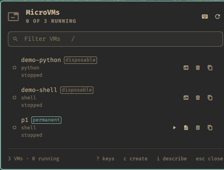
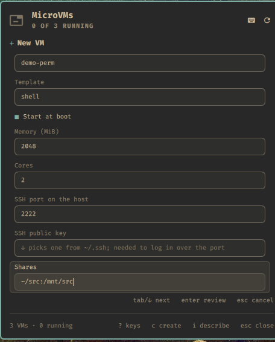
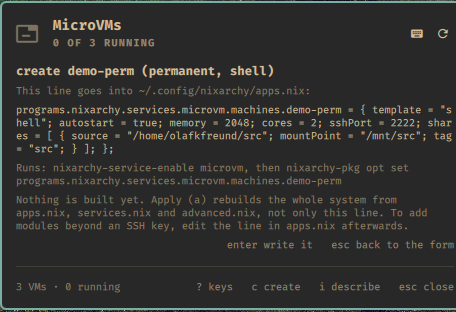
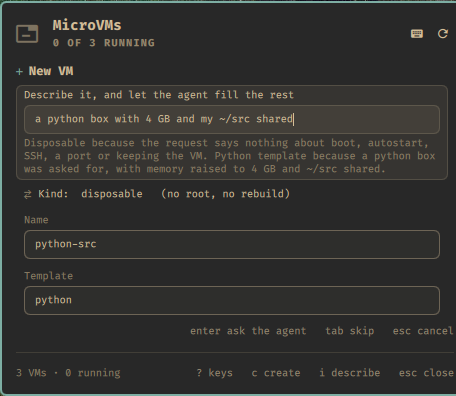

NixOS MicroVMs for the [Omarchy](https://omarchy.org) shell on
[nixarchy](https://olafkfreund.github.io/nixarchy/). Both kinds of VM nixarchy
has, in one list on the bar and behind a key, and a new one is a form away.

<figure class="shot">
  <video controls autoplay muted loop playsinline preload="metadata" aria-label="Recording of creating a disposable VM from the bar popup">
    <source src="img/rec-create.webm" type="video/webm">
    <source src="img/rec-create.mp4" type="video/mp4">
  </video>
  <figcaption>Creating a disposable VM from the keyboard: <kbd>c</kbd>, a name, a template from the list, <kbd>enter</kbd>. The new VM is in the list a moment later.</figcaption>
</figure>

## Who it is for

You run nixarchy, and sometimes you want a machine that is not your machine: a
clean NixOS to try something in, a Python box with its own packages, a sandbox
for an agent that must not reach your files, or a small server that comes up
with the host and listens on a port. nixarchy already boots those in seconds,
sharing your `/nix/store`. This is for when you would rather glance at your bar
and press a key than remember two vocabularies.

## The problem

nixarchy has two kinds of MicroVM, and both live in a terminal:

```
nixarchy vm create dev --template python   # a disposable VM
nixarchy vm run dev                        # builds, then holds this terminal
nixarchy vm list                           # a table, and nothing else can read it

programs.nixarchy.services.microvm.machines.build = {   # a permanent VM,
  template = "shell"; memory = 4096; cores = 2;         # in your own flake,
  sshPort = 2222; shares = [ { source = "/home/me/src"; mountPoint = "/mnt/src"; } ];
};                                                      # then a rebuild
```

- **Nothing shows state.** Nothing on your desktop says whether a VM is
  running, or whether a permanent one failed to come up.
- **`run` holds a terminal.** The first run builds the VM, then attaches its
  console, in the foreground.
- **A permanent VM is an attrset you write by hand.** Template, memory, cores,
  port, shares, an SSH key inside a `modules` list. A mistake shows up at the
  rebuild.
- **Two kinds, two mental models.** Nothing puts them side by side or says
  which one you want.

## What it does

**One glyph in the bar** says how your VMs are. It is dim when nothing runs,
in the accent colour when something does, and red when a permanent VM's unit
has failed.

**One list** shows every VM, running first, each with a badge for its kind, its
template and its state: *stopped*, *not built yet*, *pending apply*, or
*failed*.

<figure class="shot">
  
  <figcaption>The popup under the glyph: two disposable VMs and a permanent one. The buttons on each row are exactly the keys that apply to it.</figcaption>
</figure>

**A form for either kind.** Flip the kind with <kbd>space</kbd>. A disposable
VM is a name and a template. A permanent one adds autostart, memory, cores, an
SSH port, an SSH key picked from `~/.ssh`, and shares. A mistake is flagged
under the field before anything is written.

<div class="shot-pair">
<figure class="shot">
  
  <figcaption>The permanent half of the form. <kbd>tab</kbd> moves between fields; <kbd>↓</kbd> on the template or the key opens a list.</figcaption>
</figure>
<figure class="shot">
  
  <figcaption>Before a permanent VM is written you see its exact line, the two commands that write it, and a reminder that applying rebuilds the whole system.</figcaption>
</figure>
</div>

**Describe it instead.** With `claude` as your default agent, the form starts
with a sentence. The agent proposes the kind, the name, the template and the
numbers; the form validates them as if you had typed them, and you confirm.

<figure class="shot">
  
  <figcaption>"A python box with 4 GB and my ~/src shared", and the agent's reasoning under the field. It runs with no tools; it cannot read your files or run anything.</figcaption>
</figure>

**There are two ways in.** Click the glyph for the popup, or press
<kbd>Super</kbd>+<kbd>Alt</kbd>+<kbd>V</kbd> (or pick **MicroVMs** in the
Omarchy menu) for a larger full-screen view that holds the keyboard until you
are done.

<figure class="shot">
  
  <figcaption>The full-screen menu: the same list, form and log, drawn larger.</figcaption>
</figure>

## How it works

- **Two readers, one list.** Disposable VMs come from `nixarchy vm list`;
  permanent ones from `systemctl` and from the lines in
  `~/.config/nixarchy/apps.nix`. A line the plugin wrote is *managed*; a line
  you edited by hand, or a machine declared elsewhere in your flake, is shown
  but never rewritten.
- **A permanent VM is one line, written by nixarchy's own writers.** The
  plugin never touches a unit file, `/var/lib/microvms` or your flake. It
  hands one line to nixarchy.pkg's `opt set`, which parse-checks the file and
  reverts on failure. Applying is your own `nixarchy-apply`, opened in a
  terminal so you see every prompt and everything it rebuilds.
- **It detects what your nixarchy can do.** Keys that need a newer
  `nixarchy vm` (a build log in the panel, attaching to a running VM,
  changing a template) or a newer nixarchy-pkg (editing a permanent VM's
  line) appear once those features exist. Until then, starting a disposable
  VM opens `nixarchy vm run` in a terminal, and the footer says so.
- **One change at a time.** The bar and the menu share one state. While a
  start, stop, delete, create or edit runs, anything else that would change a
  VM is refused, and the refusal says why.

## Why it is built this way

- **Allowlists before Nix.** Every value that reaches the apps.nix line comes
  from a validator: a template from the catalogue, bounded integers, paths
  from a character set with no `"`, `\` or `${`, an SSH key kept to its type
  and blob, share tags that never collide with the guest's own. The grammar
  is fixed, and the plugin reads back only what it writes.
- **The agent proposes, the form decides.** AI assist is one non-interactive
  `claude` call with every tool switched off and a strict JSON schema. Its
  reply is converted per field, validated as if typed, and shown with its
  reasoning. Nothing in it is executed; a prompt asking it to read a file or
  run a command yields at most a filled form.
- **Nothing irreversible happens by accident.** <kbd>x</kbd> asks first, with
  **Cancel** selected, and says what it will and will not remove: a permanent
  VM's state directory is never deleted by this plugin.
- **Keyboard first.** Omarchy is a keyboard desktop. Every action has a key,
  and a key that does not apply to a row is absent rather than broken. Press
  <kbd>?</kbd> for all of them.
- **No daemon, no wrapper.** It runs `nixarchy-vm` and `systemctl` from your
  `PATH`, as you. A closed surface does nothing, and the only background work
  is a slow check that keeps the glyph honest.

## A tour

1. Press <kbd>Super</kbd>+<kbd>Alt</kbd>+<kbd>V</kbd>. The list opens with
   your VMs, running first.
2. <kbd>c</kbd>, a name, a template, <kbd>enter</kbd>: a disposable VM.
   <kbd>enter</kbd> on its row starts it in a terminal; <kbd>s</kbd> stops it.
3. <kbd>c</kbd>, <kbd>space</kbd> on Kind, the fields, <kbd>enter</kbd>: the
   review shows the line. <kbd>enter</kbd> again writes it, and the row says
   *pending apply* until <kbd>a</kbd> opens `nixarchy-apply`.
4. <kbd>i</kbd>, a sentence, <kbd>enter</kbd>: the agent fills the form.
5. <kbd>?</kbd> lists every key. <kbd>esc</kbd> closes.

## Set it up

On NixOS with nixarchy, add the flake, install the plugin, and let its Home
Manager module write the key bind:

```nix
inputs.nixarchy-microvm = {
  url = "github:olafkfreund/nixarchy-microvm";
  inputs.nixpkgs.follows = "nixpkgs";
};

# NixOS
programs.nixarchy.plugins."nixarchy.microvm".src =
  inputs.nixarchy-microvm.packages.${pkgs.stdenv.hostPlatform.system}.default;

# Home Manager
imports = [ inputs.nixarchy-microvm.homeManagerModules.default ];
programs.nixarchy-microvm.keybinding = "SUPER + ALT + V";   # the default; null writes no bind
```

Then one line in `~/.config/hypr/bindings.lua`, so the bind loads:

```lua
pcall(require, "hypr.microvm-binds")
```

Rebuild, then enable it once:

```
omarchy plugin enable nixarchy.microvm
```

Without Nix: `omarchy plugin add https://github.com/olafkfreund/nixarchy-microvm`,
the same `enable`, and copy `microvm-binds.lua` from the plugin folder into
`~/.config/hypr/` before adding the `pcall` line.

**Permanent VMs** need the [nixarchy.pkg](https://github.com/olafkfreund/nixarchy-pkg)
plugin, whose writers put the line into `apps.nix`. **AI assist** needs
`omarchy default agent claude`.

**[Read the manual](usage/)** for the Omarchy menu row, settings,
troubleshooting and removal. The source is at
[github.com/olafkfreund/nixarchy-microvm](https://github.com/olafkfreund/nixarchy-microvm).

---

*Every image on this page is the real plugin on a real machine, driven from the
keyboard. It was captured with throwaway `demo-*` disposable VMs, which were
removed afterwards; the permanent VM in the list is the machine that host
declares. The machine's own configuration was not changed.*
